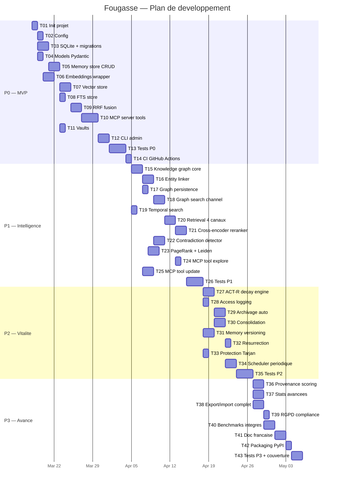

# Plan de developpement — core

**Date** : 2026-03-17
**Contexte** : architecture-technique.md, stack-technique.md

## Vue d'ensemble

```
+-------------------------------------------------------------+
|                    LLM Clients (MCP)                         |
|  Claude Desktop | Claude Code | Cursor | Windsurf | Cruchot |
+-----------------------------+-------------------------------+
                              |
                         stdio / SSE
                              |
+-----------------------------v-------------------------------+
|                  Fougasse MCP Server                         |
|                                                              |
|  Tools: remember | recall | forget | update | explore |      |
|         status | vaults                                      |
|                                                              |
|  +------------------+  +------------------+                  |
|  | Embeddings       |  | Config           |                  |
|  | (BGE-Base, load  |  | (~/.fougasse/    |                  |
|  |  once at start)  |  |  config.toml)    |                  |
|  +------------------+  +------------------+                  |
|                                                              |
|  +-------------------------------------------------------+  |
|  |              Retrieval Engine                          |  |
|  |  [Vec KNN] [FTS5 BM25] [Graph] [Temporal]             |  |
|  |       \        |         |        /                    |  |
|  |        +-- RRF Fusion --+--------+                     |  |
|  |                |                                       |  |
|  |        [Cross-Encoder Rerank] (P1)                     |  |
|  +-------------------------------------------------------+  |
|                                                              |
|  +-------------------------------------------------------+  |
|  |              Knowledge Graph (NetworkX)                |  |
|  |  Nodes: memories + entities                            |  |
|  |  Edges: relates_to, supersedes, conflicts_with         |  |
|  |  Algos: PageRank, Leiden, Tarjan, Spreading Activation |  |
|  +-------------------------------------------------------+  |
|                                                              |
|  +-------------------------------------------------------+  |
|  |              Vitality Engine (P2)                      |  |
|  |  ACT-R decay | Consolidation | Archival               |  |
|  +-------------------------------------------------------+  |
|                                                              |
+-----------------------------+-------------------------------+
                              |
+-----------------------------v-------------------------------+
|                    SQLite Database                            |
|  memory.db: memories, vec0, FTS5, graph, access_log         |
|  learning.db: search_patterns, feedback (RGPD)              |
+-------------------------------------------------------------+
```

## Structure du projet

```
fougasse/
  pyproject.toml                      # uv + hatchling config
  CLAUDE.md                           # Stack best practices
  README.md                           # Doc francais
  LICENSE
  src/fougasse/
    __init__.py                       # __version__
    __main__.py                       # python -m fougasse
    server.py                         # MCP server + tools
    cli.py                            # Click CLI
    config.py                         # TOML config
    models.py                         # Pydantic models
    embeddings.py                     # BGE-Base wrapper
    storage/
      __init__.py
      database.py                     # SQLite connection + migrations
      memory_store.py                 # CRUD memories
      vector_store.py                 # sqlite-vec ops
      fts_store.py                    # FTS5 ops
      migrations.py                   # Migration runner
    retrieval/
      __init__.py
      hybrid_search.py                # 4-channel orchestrator
      rrf_fusion.py                   # RRF SQL + Python
      temporal_search.py              # Temporal filtering
      graph_search.py                 # Spreading activation
      reranker.py                     # Cross-encoder (P1)
    graph/
      __init__.py
      knowledge_graph.py              # NetworkX core
      entity_linker.py                # Edge creation from tags/entities
      contradiction_detector.py       # Semantic contradiction check
      community_detector.py           # Leiden clustering
      persistence.py                  # Graph <-> SQLite sync
    vitality/
      __init__.py
      decay_engine.py                 # ACT-R calculator
      consolidation.py                # Memory merge + archive
      scheduler.py                    # Periodic process
  migrations/
    001_init.sql
    002_vitality.sql
    003_versioning.sql
  tests/
    conftest.py
    test_storage/
      test_database.py
      test_memory_store.py
      test_vector_store.py
      test_fts_store.py
    test_retrieval/
      test_hybrid_search.py
      test_rrf_fusion.py
      test_temporal_search.py
      test_graph_search.py
      test_reranker.py
    test_graph/
      test_knowledge_graph.py
      test_entity_linker.py
      test_contradiction_detector.py
      test_community_detector.py
    test_vitality/
      test_decay_engine.py
      test_consolidation.py
    test_server.py
    test_cli.py
```

## Modele de donnees

```
memories ──1:N── tags
    |
    1:N── memory_versions
    |
    1:1── vec_memories (embedding)
    |
    1:1── fts_memories (content index)
    |
    N:1── vaults
    |
    1:N── access_log
    |
    1:1── graph_nodes (type='memory')
              |
              N:N── graph_edges ──N:N── graph_nodes (type='entity')
```

## Phases de developpement

### P0 — MVP : Stockage + Recherche hybride + MCP
Le coeur de Fougasse : on peut memoriser et retrouver via MCP.

| # | Tache | Detail |
|---|-------|--------|
| T01 | Init projet | pyproject.toml, uv, structure dossiers, CI |
| T02 | Config | Module config.py, fichier TOML, defaults |
| T03 | SQLite + migrations | database.py, WAL, FK, migration runner, 001_init.sql |
| T04 | Models Pydantic | Memory, Vault, SearchResult, MemoryCreate, etc. |
| T05 | Memory store CRUD | insert, get, update, soft-delete, list, filter by vault/type/tags |
| T06 | Embeddings wrapper | Load BGE-Base, encode, batch, normalize, cache model |
| T07 | Vector store | sqlite-vec integration, insert embedding, KNN search |
| T08 | FTS store | FTS5 index, BM25 search, sync triggers |
| T09 | RRF fusion | SQL-based fusion vec + FTS, Python combiner |
| T10 | MCP server tools | fougasse_remember, fougasse_recall, fougasse_forget, fougasse_status |
| T11 | Vaults | CRUD vaults, default vault, vault filtering |
| T12 | CLI admin | Click: status, prune, export, import, vaults |
| T13 | Tests P0 | Tests unitaires + integration pour tout P0 |
| T14 | CI GitHub Actions | Matrix macOS/Windows/Linux, pytest, ruff, mypy |

### P1 — Intelligence : Graphe + Retrieval avance + Contradictions
Fougasse devient intelligent : il relie les memoires et detecte les contradictions.

| # | Tache | Detail |
|---|-------|--------|
| T15 | Knowledge graph core | NetworkX DiGraph, add/remove nodes/edges, persistence SQLite |
| T16 | Entity linker | Creation d'edges automatiques (tags partages, entites communes, proximite semantique) |
| T17 | Graph persistence | Sync bidirectionnel NetworkX <-> SQLite (tables graph_nodes, graph_edges) |
| T18 | Graph search channel | Spreading activation retrieval (3 hops, decay factor) |
| T19 | Temporal search channel | Filtrage par fenetres temporelles (created_at, valid_from/to) |
| T20 | Retrieval 4 canaux | Orchestrateur hybrid_search.py combinant les 4 canaux paralleles |
| T21 | Cross-encoder reranker | Integration ms-marco-MiniLM reranker, toggle config |
| T22 | Contradiction detector | Heuristique : haute similarite + negation → lien supersedes/conflicts_with |
| T23 | PageRank + Leiden | Calcul periodique PageRank, detection communautes Leiden |
| T24 | MCP tool explore | fougasse_explore : navigation graphe, voisins, clusters |
| T25 | MCP tool update | fougasse_update : mise a jour avec versioning |
| T26 | Tests P1 | Tests unitaires + integration pour tout P1 |

### P2 — Vitalite : Declin + Consolidation + Versioning
Fougasse oublie ce qui n'est plus pertinent et renforce ce qui compte.

| # | Tache | Detail |
|---|-------|--------|
| T27 | ACT-R decay engine | Calcul vitalite = sum(t_i^-0.5), mise a jour des scores |
| T28 | Access logging | Enregistrement de chaque acces en lecture (pour ACT-R) |
| T29 | Archivage automatique | Process periodique : archiver memoires sous seuil de vitalite |
| T30 | Consolidation | Fusion de memoires redondantes (haute similarite + meme vault) |
| T31 | Memory versioning | Historique des modifications, diff entre versions |
| T32 | Resurrection | Boost de vitalite quand une memoire archivee est retrouvee par search |
| T33 | Protection Tarjan | Warning avant suppression de noeuds critiques (points d'articulation) |
| T34 | Scheduler periodique | Process background pour decay + consolidation (configurable) |
| T35 | Tests P2 | Tests unitaires + integration pour tout P2 |

### P3 — Avance : Securite + Stats + Polish
Fougasse est robuste, mesurable et pret pour la production.

| # | Tache | Detail |
|---|-------|--------|
| T36 | Provenance scoring | Score de confiance par source_agent (Beta-Binomial bayesien) |
| T37 | Statistiques avancees | Metriques : count, size, active/declining, latence P50/P95, top entities |
| T38 | Export/import complet | JSON structure avec metadata, embeddings optionnels, graphe |
| T39 | RGPD compliance | learning.db separe, hard-delete, export donnees personnelles |
| T40 | Benchmarks integres | CLI `fougasse bench` : mesure latence retrieval, precision, throughput |
| T41 | Documentation francaise | README complet, guide installation, guide usage, guide contribution |
| T42 | Packaging PyPI | Build hatch, publish sur PyPI, instructions install |
| T43 | Tests P3 + couverture | Tests finaux, coverage >80%, rapport |

## Tests
- **Strategie** : tests unitaires par module + tests integration MCP end-to-end
- **Fixtures** : DB in-memory, mock embeddings (vecteurs fixes), graphe minimal
- **Integration** : MCP client → server → DB → response (via mcp SDK test utilities)
- **Performance** : benchmark latence retrieval dans les tests CI (regression detection)
- **Matrix** : macOS ARM, Windows x64, Linux x64 via GitHub Actions
- **Priorite P0** : storage, retrieval, server tools, CLI

## References MCP
| Etape | MCP | Requete |
|-------|-----|---------|
| T10 | Context7 | @modelcontextprotocol/python-sdk — MCPServer tools, lifespan, stdio |
| T07 | Context7 | @asg017/sqlite-vec — vec0 table, KNN, metadata filtering |
| T09 | Context7 | @asg017/sqlite-vec — RRF fusion SQL example |
| T12 | Context7 | @pallets/click — CLI groups, commands, options |
| T06 | Context7 | @sentence-transformers — encode, normalize, batch |

## Ordre d'execution



## Checklist de lancement
- [ ] uv init + pyproject.toml fonctionnel
- [ ] `uv run fougasse status` retourne un JSON valide
- [ ] MCP server connectable depuis Claude Code via stdio
- [ ] `fougasse_remember` + `fougasse_recall` fonctionnels end-to-end
- [ ] Tests passent sur macOS, Windows, Linux
- [ ] README.md en francais avec instructions d'installation
- [ ] Publie sur PyPI : `pip install fougasse`
