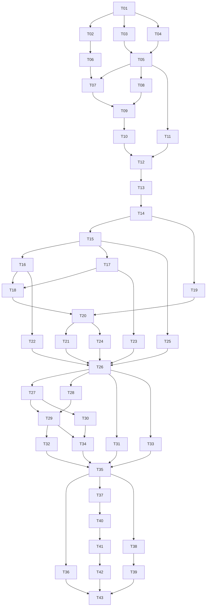

# Taches — core

**Date** : 2026-03-17
**Nombre de taches** : 43
**Phases** : P0 (14 taches), P1 (12 taches), P2 (9 taches), P3 (8 taches)

## Taches

### T01 · Init projet

**Phase** : P0
**But** : Scaffolding complet du projet avec uv, pyproject.toml, structure de dossiers.

**Fichiers concernes** :
- `[NEW]` `pyproject.toml`
- `[NEW]` `src/fougasse/__init__.py`
- `[NEW]` `src/fougasse/__main__.py`
- `[NEW]` `.gitignore`
- `[NEW]` `LICENSE`
- `[NEW]` `.github/workflows/ci.yml` (placeholder)

**Piste** : infra

**Dependances** : aucune

**Criteres d'acceptation** :
- [ ] `uv sync` installe les deps sans erreur
- [ ] `uv run python -m fougasse` retourne un message de version
- [ ] Structure de dossiers conforme a l'architecture technique
- [ ] .gitignore couvre .venv, __pycache__, *.db, .fougasse/

---

### T02 · Config

**Phase** : P0
**But** : Module de configuration avec fichier TOML et valeurs par defaut.

**Fichiers concernes** :
- `[NEW]` `src/fougasse/config.py`
- `[NEW]` `tests/test_config.py`

**Piste** : backend

**Dependances** : T01

**Criteres d'acceptation** :
- [ ] Config charge `~/.fougasse/config.toml` s'il existe
- [ ] Valeurs par defaut pour : db_path, model_name, vault_default, vitality_threshold, max_results
- [ ] Override par variables d'environnement (FOUGASSE_DB_PATH, etc.)
- [ ] Creation automatique du dossier `~/.fougasse/` si absent

---

### T03 · SQLite + migrations

**Phase** : P0
**But** : Couche database avec connexion SQLite, WAL, FK, et systeme de migrations.

**Fichiers concernes** :
- `[NEW]` `src/fougasse/storage/__init__.py`
- `[NEW]` `src/fougasse/storage/database.py`
- `[NEW]` `src/fougasse/storage/migrations.py`
- `[NEW]` `migrations/001_init.sql`
- `[NEW]` `tests/test_storage/test_database.py`

**Piste** : backend

**Dependances** : T01

**Criteres d'acceptation** :
- [ ] Connexion SQLite avec WAL mode et foreign keys actives
- [ ] Migration runner applique les scripts SQL dans l'ordre
- [ ] Table `schema_version` tracke les migrations appliquees
- [ ] 001_init.sql cree : memories, vaults, tags, access_log, graph_nodes, graph_edges
- [ ] Tests avec DB in-memory

---

### T04 · Models Pydantic

**Phase** : P0
**But** : Modeles de donnees Pydantic pour la validation des inputs/outputs MCP.

**Fichiers concernes** :
- `[NEW]` `src/fougasse/models.py`
- `[NEW]` `tests/test_models.py`

**Piste** : backend

**Dependances** : T01

**Criteres d'acceptation** :
- [ ] MemoryCreate : content (str, max 100KB), type (enum), tags (list[str], max 20), vault_id (str), metadata (dict optional)
- [ ] Memory : id, content, type, tags, vault_id, source_agent, vitality_score, created_at, updated_at
- [ ] SearchQuery : query (str), vault_id (optional), type_filter (optional), limit (int, default 10), min_score (float, optional)
- [ ] SearchResult : memories (list), scores (list), total_count (int)
- [ ] Vault : id, name, description, created_at, memory_count
- [ ] FougasseStatus : version, memory_count, vault_count, db_size_bytes, uptime_seconds

---

### T05 · Memory store CRUD

**Phase** : P0
**But** : Operations CRUD sur les memoires dans SQLite.

**Fichiers concernes** :
- `[NEW]` `src/fougasse/storage/memory_store.py`
- `[NEW]` `tests/test_storage/test_memory_store.py`

**Piste** : backend

**Dependances** : T03, T04

**Criteres d'acceptation** :
- [ ] insert_memory : genere UUID v7, stocke dans memories + tags
- [ ] get_memory : retourne par ID avec tags
- [ ] update_memory : met a jour content/type/tags/metadata, incremente updated_at
- [ ] delete_memory : soft-delete (is_archived=1) par defaut, hard-delete optionnel
- [ ] list_memories : filtrage par vault_id, type, tags, is_archived, pagination
- [ ] Toutes les queries sont parametrees (zero string interpolation)
- [ ] Tests couvrent CRUD + edge cases (ID inexistant, doublon, etc.)

---

### T06 · Embeddings wrapper

**Phase** : P0
**But** : Wrapper sentence-transformers pour charger BGE-Base et encoder du texte.

**Fichiers concernes** :
- `[NEW]` `src/fougasse/embeddings.py`
- `[NEW]` `tests/test_embeddings.py`

**Piste** : backend

**Dependances** : T02

**Criteres d'acceptation** :
- [ ] Charge `BAAI/bge-base-en-v1.5` au premier appel (lazy) ou via lifespan
- [ ] Cache le modele dans `~/.fougasse/models/`
- [ ] `encode(text) -> list[float]` avec normalisation L2
- [ ] `encode_batch(texts) -> list[list[float]]` pour ingestion en masse
- [ ] Auto-detection device : MPS (Mac), CUDA (GPU), CPU (fallback)
- [ ] `serialize(vector) -> bytes` via struct.pack pour sqlite-vec
- [ ] Tests avec mock embeddings (vecteurs fixes) pour les tests rapides

---

### T07 · Vector store

**Phase** : P0
**But** : Integration sqlite-vec pour stockage et recherche vectorielle.

**Fichiers concernes** :
- `[NEW]` `src/fougasse/storage/vector_store.py`
- `[NEW]` `tests/test_storage/test_vector_store.py`
- `[MODIFY]` `migrations/001_init.sql` (ajout vec0 table)

**Piste** : backend

**Dependances** : T05, T06

**Criteres d'acceptation** :
- [ ] `sqlite_vec.load(db)` charge l'extension sans erreur sur macOS/Windows/Linux
- [ ] Table vec0 `vec_memories` avec float[768], memory_id, vault_id, is_archived
- [ ] `insert_vector(memory_id, embedding)` stocke le vecteur
- [ ] `search_knn(query_embedding, k, vault_id=None) -> [(memory_id, distance)]`
- [ ] Metadata filtering : vault_id et is_archived dans la requete KNN
- [ ] Tests KNN avec vecteurs connus (distances calculees a la main)

---

### T08 · FTS store

**Phase** : P0
**But** : Index FTS5 pour la recherche plein texte BM25.

**Fichiers concernes** :
- `[NEW]` `src/fougasse/storage/fts_store.py`
- `[NEW]` `tests/test_storage/test_fts_store.py`
- `[MODIFY]` `migrations/001_init.sql` (ajout FTS5 table + triggers)

**Piste** : backend

**Dependances** : T05

**Criteres d'acceptation** :
- [ ] Table FTS5 `fts_memories` indexe content + tags
- [ ] Triggers SQLite pour sync auto : INSERT/UPDATE/DELETE sur memories → FTS5
- [ ] `search_bm25(query, limit) -> [(memory_id, rank)]`
- [ ] Recherche multi-termes fonctionnelle
- [ ] Tests avec corpus de test (10+ memoires, queries variees)

---

### T09 · RRF fusion

**Phase** : P0
**But** : Fusion Reciprocal Rank Fusion entre resultats vec et FTS.

**Fichiers concernes** :
- `[NEW]` `src/fougasse/retrieval/__init__.py`
- `[NEW]` `src/fougasse/retrieval/rrf_fusion.py`
- `[NEW]` `src/fougasse/retrieval/hybrid_search.py` (version P0 : 2 canaux)
- `[NEW]` `tests/test_retrieval/test_rrf_fusion.py`
- `[NEW]` `tests/test_retrieval/test_hybrid_search.py`

**Piste** : backend

**Dependances** : T07, T08

**Criteres d'acceptation** :
- [ ] RRF en SQL (FULL OUTER JOIN vec + FTS avec formule 1/(k+rank))
- [ ] Fallback Python si la requete SQL est trop complexe
- [ ] `hybrid_search(query, vault_id, limit) -> SearchResult`
- [ ] k parameter configurable (defaut : 60)
- [ ] Tests : verifier que la fusion ameliore les resultats vs vec seul ou FTS seul

---

### T10 · MCP server tools

**Phase** : P0
**But** : Serveur MCP avec les 4 tools de base : remember, recall, forget, status.

**Fichiers concernes** :
- `[NEW]` `src/fougasse/server.py`
- `[NEW]` `tests/test_server.py`

**Piste** : backend

**Dependances** : T09

**Securite** : validation Pydantic sur tous les inputs, logging via ctx (jamais le contenu en INFO)

**Criteres d'acceptation** :
- [ ] MCPServer avec lifespan (charge embeddings + ouvre DB)
- [ ] Tool `fougasse_remember(content, type, tags, vault_id, metadata)` → stocke + embed + retourne ID
- [ ] Tool `fougasse_recall(query, vault_id, type_filter, limit)` → recherche hybride → retourne resultats
- [ ] Tool `fougasse_forget(memory_id)` → soft-delete
- [ ] Tool `fougasse_status()` → stats du serveur
- [ ] Transport stdio fonctionnel
- [ ] Test end-to-end : remember → recall retrouve la memoire

---

### T11 · Vaults

**Phase** : P0
**But** : Gestion des vaults (namespaces isoles).

**Fichiers concernes** :
- `[MODIFY]` `src/fougasse/storage/memory_store.py`
- `[MODIFY]` `src/fougasse/server.py`
- `[NEW]` `tests/test_vaults.py`

**Piste** : backend

**Dependances** : T05

**Criteres d'acceptation** :
- [ ] Vault "default" cree automatiquement
- [ ] CRUD vaults : create, list, delete
- [ ] Toutes les operations memoire filtrent par vault_id
- [ ] Tool MCP `fougasse_vaults(action, name, description)` pour gerer les vaults
- [ ] Suppression vault : confirmation si non vide, cascade sur memoires

---

### T12 · CLI admin

**Phase** : P0
**But** : Interface CLI pour administration (status, prune, export, import).

**Fichiers concernes** :
- `[NEW]` `src/fougasse/cli.py`
- `[NEW]` `tests/test_cli.py`

**Piste** : backend

**Dependances** : T10, T11

**Criteres d'acceptation** :
- [ ] Commande `fougasse status` : affiche stats (Rich table)
- [ ] Commande `fougasse prune` : supprime memoires archivees, option `--hard`
- [ ] Commande `fougasse export [--vault] [--format json]` : exporte en JSON
- [ ] Commande `fougasse import <file>` : importe depuis JSON
- [ ] Commande `fougasse vaults` : liste les vaults
- [ ] Flag `--json` sur toutes les commandes pour output machine-readable
- [ ] Entry point dans pyproject.toml : `[project.scripts] fougasse = "fougasse.cli:main"`

---

### T13 · Tests P0

**Phase** : P0
**But** : Couverture de tests complete pour toute la phase P0.

**Fichiers concernes** :
- `[NEW]` `tests/conftest.py`
- `[MODIFY]` tous les fichiers test_*.py existants
- `[NEW]` `tests/test_integration_p0.py`

**Piste** : backend

**Dependances** : T12

**Criteres d'acceptation** :
- [ ] conftest.py avec fixtures : db_memory (in-memory), mock_embeddings, sample_memories
- [ ] Tests integration : remember → recall → forget cycle complet
- [ ] Tests multi-vault : isolation verifiee
- [ ] Coverage >70% sur les modules P0
- [ ] Tous les tests passent avec `uv run pytest`

---

### T14 · CI GitHub Actions

**Phase** : P0
**But** : Pipeline CI avec test matrix cross-platform.

**Fichiers concernes** :
- `[NEW]` `.github/workflows/ci.yml`

**Piste** : infra

**Dependances** : T13

**Criteres d'acceptation** :
- [ ] Matrix : macOS-latest (ARM), windows-latest, ubuntu-latest
- [ ] Python 3.11 + 3.12
- [ ] Steps : uv sync, ruff check, ruff format --check, mypy, pytest
- [ ] Cache uv deps entre runs
- [ ] Badge status dans README

---

### T15 · Knowledge graph core

**Phase** : P1
**But** : Graphe de connaissances NetworkX avec operations de base.

**Fichiers concernes** :
- `[NEW]` `src/fougasse/graph/__init__.py`
- `[NEW]` `src/fougasse/graph/knowledge_graph.py`
- `[NEW]` `tests/test_graph/test_knowledge_graph.py`

**Piste** : backend

**Dependances** : T14

**Criteres d'acceptation** :
- [ ] DiGraph NetworkX avec types de noeuds : memory, entity
- [ ] Types de relations : relates_to, supersedes, conflicts_with, tagged_with
- [ ] add_node, add_edge, remove_node, remove_edge, get_neighbors, get_subgraph
- [ ] Charge au demarrage depuis SQLite, sync sur ecriture
- [ ] Tests avec graphe minimal (5 noeuds, 10 edges)

---

### T16 · Entity linker

**Phase** : P1
**But** : Creation automatique d'aretes basee sur tags partages et proximite semantique.

**Fichiers concernes** :
- `[NEW]` `src/fougasse/graph/entity_linker.py`
- `[NEW]` `tests/test_graph/test_entity_linker.py`

**Piste** : backend

**Dependances** : T15

**Criteres d'acceptation** :
- [ ] Quand une memoire est inseree, creer des edges `tagged_with` vers les entites-tags
- [ ] Si deux memoires partagent 2+ tags, creer un edge `relates_to`
- [ ] Si similarite cosinus >0.8 entre deux memoires du meme vault, creer un edge `relates_to`
- [ ] Poids des edges proportionnel au nombre de liens partages
- [ ] Tests : inserer 3 memoires avec tags communs, verifier les edges crees

---

### T17 · Graph persistence

**Phase** : P1
**But** : Synchronisation bidirectionnelle entre NetworkX et SQLite.

**Fichiers concernes** :
- `[NEW]` `src/fougasse/graph/persistence.py`
- `[NEW]` `tests/test_graph/test_persistence.py`

**Piste** : backend

**Dependances** : T15

**Criteres d'acceptation** :
- [ ] `save_graph(G, db)` : serialise noeuds + aretes dans graph_nodes + graph_edges
- [ ] `load_graph(db) -> DiGraph` : reconstruit le graphe depuis SQLite
- [ ] Sync incrementale sur ecriture (pas de dump complet a chaque ajout)
- [ ] Tests : save → load → verifier isomorphisme

---

### T18 · Graph search channel

**Phase** : P1
**But** : Canal de recherche par traversal du graphe (spreading activation).

**Fichiers concernes** :
- `[NEW]` `src/fougasse/retrieval/graph_search.py`
- `[NEW]` `tests/test_retrieval/test_graph_search.py`

**Piste** : backend

**Dependances** : T16, T17

**Criteres d'acceptation** :
- [ ] Depuis un noeud seed (memoire la plus proche du query), diffuser l'activation sur 3 hops
- [ ] Facteur de decroissance configurable (defaut : 0.5 par hop)
- [ ] Retourne les noeuds actives tries par score d'activation
- [ ] Ignore les noeuds archives
- [ ] Tests avec graphe connu, verification des scores attendus

---

### T19 · Temporal search channel

**Phase** : P1
**But** : Canal de recherche par proximite temporelle.

**Fichiers concernes** :
- `[NEW]` `src/fougasse/retrieval/temporal_search.py`
- `[NEW]` `tests/test_retrieval/test_temporal_search.py`

**Piste** : backend

**Dependances** : T14

**Criteres d'acceptation** :
- [ ] Boost les memoires recentes (decroissance exponentielle par age)
- [ ] Filtrage par plage de dates (from/to)
- [ ] Score temporel = exp(-lambda * age_in_days), lambda configurable
- [ ] Combine avec les autres canaux via RRF
- [ ] Tests avec memoires de dates variees, verification de l'ordonnancement

---

### T20 · Retrieval 4 canaux

**Phase** : P1
**But** : Orchestrateur qui combine les 4 canaux de recherche en parallele.

**Fichiers concernes** :
- `[MODIFY]` `src/fougasse/retrieval/hybrid_search.py`
- `[MODIFY]` `tests/test_retrieval/test_hybrid_search.py`

**Piste** : backend

**Dependances** : T18, T19

**Criteres d'acceptation** :
- [ ] Execute vec KNN + FTS BM25 + graph spreading + temporal en parallele (asyncio)
- [ ] Fusionne via RRF etendu (4 listes de rangs)
- [ ] Poids configurables par canal (defaut : tous a 1.0)
- [ ] Fallback gracieux : si un canal echoue, les 3 autres suffisent
- [ ] Tests end-to-end avec les 4 canaux actifs

---

### T21 · Cross-encoder reranker

**Phase** : P1
**But** : Reranking des resultats top-K via cross-encoder pour ameliorer la precision.

**Fichiers concernes** :
- `[NEW]` `src/fougasse/retrieval/reranker.py`
- `[NEW]` `tests/test_retrieval/test_reranker.py`

**Piste** : backend

**Dependances** : T20

**Criteres d'acceptation** :
- [ ] Charge `cross-encoder/ms-marco-MiniLM-L-6-v2` (lazy)
- [ ] Reranke les top-K resultats (defaut K=20) apres la fusion RRF
- [ ] Activable/desactivable via config (`reranker.enabled = true/false`)
- [ ] Latence <100ms pour 20 candidats
- [ ] Tests : verifier que le reranking change l'ordre des resultats

---

### T22 · Contradiction detector

**Phase** : P1
**But** : Detection heuristique de contradictions a l'ecriture.

**Fichiers concernes** :
- `[NEW]` `src/fougasse/graph/contradiction_detector.py`
- `[NEW]` `tests/test_graph/test_contradiction_detector.py`

**Piste** : backend

**Dependances** : T16

**Criteres d'acceptation** :
- [ ] A l'ingestion, cherche les memoires avec similarite >0.85 dans le meme vault
- [ ] Si haute similarite + patterns de negation detectes → lien `supersedes`
- [ ] Si haute similarite + ambiguite → lien `conflicts_with`
- [ ] Retourne un warning dans la reponse du tool `fougasse_remember`
- [ ] Patterns de negation : "ne...pas", "plus", "annule", "remplace", "contrairement", "en fait"
- [ ] Tests avec paires contradictoires et non-contradictoires

---

### T23 · PageRank + Leiden

**Phase** : P1
**But** : Calcul periodique de PageRank et detection de communautes.

**Fichiers concernes** :
- `[NEW]` `src/fougasse/graph/community_detector.py`
- `[MODIFY]` `src/fougasse/graph/knowledge_graph.py`
- `[NEW]` `tests/test_graph/test_community_detector.py`

**Piste** : backend

**Dependances** : T17

**Criteres d'acceptation** :
- [ ] `compute_pagerank(G)` → met a jour les scores dans graph_nodes
- [ ] `detect_communities(G)` → Leiden via leidenalg (conversion NetworkX → igraph)
- [ ] Stocke community_id dans graph_nodes
- [ ] Declenchable manuellement ou via scheduler
- [ ] Tests avec graphe de communautes connues

---

### T24 · MCP tool explore

**Phase** : P1
**But** : Tool MCP pour naviguer dans le graphe de connaissances.

**Fichiers concernes** :
- `[MODIFY]` `src/fougasse/server.py`
- `[MODIFY]` `tests/test_server.py`

**Piste** : backend

**Dependances** : T20

**Criteres d'acceptation** :
- [ ] Tool `fougasse_explore(entry_point, depth, max_nodes)` → retourne sous-graphe
- [ ] Entry point : memory_id, tag, ou query text
- [ ] Retourne : noeuds, aretes, communautes, scores PageRank
- [ ] Format JSON navigable par le LLM

---

### T25 · MCP tool update

**Phase** : P1
**But** : Tool MCP pour mettre a jour une memoire avec versioning.

**Fichiers concernes** :
- `[MODIFY]` `src/fougasse/server.py`
- `[MODIFY]` `src/fougasse/storage/memory_store.py`
- `[NEW]` `migrations/003_versioning.sql`
- `[MODIFY]` `tests/test_server.py`

**Piste** : backend

**Dependances** : T15

**Criteres d'acceptation** :
- [ ] Tool `fougasse_update(memory_id, content, type, tags, metadata)` → met a jour
- [ ] Cree une entree dans memory_versions avant la mise a jour
- [ ] Re-genere l'embedding si content change
- [ ] Met a jour le graphe (nouveaux tags → nouveaux edges)
- [ ] Retourne la version actuelle et le nombre de versions

---

### T26 · Tests P1

**Phase** : P1
**But** : Couverture de tests complete pour la phase P1.

**Fichiers concernes** :
- `[NEW]` `tests/test_integration_p1.py`
- `[MODIFY]` tous les fichiers test_*.py P1

**Piste** : backend

**Dependances** : T24, T25, T21, T22, T23

**Criteres d'acceptation** :
- [ ] Tests integration : remember → graphe construit → explore retourne les voisins
- [ ] Tests contradiction : remember contradictoire → warning + lien supersedes
- [ ] Tests reranker : resultats rerankes different de l'ordre RRF brut
- [ ] Tests 4 canaux : verifier que chaque canal contribue au score final
- [ ] Coverage >75% sur les modules P1

---

### T27 · ACT-R decay engine

**Phase** : P2
**But** : Calcul de vitalite basé sur le modele ACT-R.

**Fichiers concernes** :
- `[NEW]` `src/fougasse/vitality/__init__.py`
- `[NEW]` `src/fougasse/vitality/decay_engine.py`
- `[NEW]` `tests/test_vitality/test_decay_engine.py`

**Piste** : backend

**Dependances** : T26

**Criteres d'acceptation** :
- [ ] `compute_vitality(memory_id)` → `sum(t_i^-0.5)` pour chaque acces dans access_log
- [ ] `update_all_vitalities()` → recalcule pour toutes les memoires actives
- [ ] Parametre d configurable (defaut 0.5)
- [ ] Performance : <1s pour 100K memoires
- [ ] Tests avec acces_log connus, verification des scores attendus

---

### T28 · Access logging

**Phase** : P2
**But** : Enregistrement de chaque acces en lecture pour alimenter le moteur de vitalite.

**Fichiers concernes** :
- `[MODIFY]` `src/fougasse/retrieval/hybrid_search.py`
- `[MODIFY]` `src/fougasse/storage/memory_store.py`
- `[NEW]` `tests/test_vitality/test_access_logging.py`

**Piste** : backend

**Dependances** : T26

**Criteres d'acceptation** :
- [ ] Chaque `fougasse_recall` qui retourne des resultats → log dans access_log
- [ ] Chaque `fougasse_explore` → log des noeuds visites
- [ ] Batch insert pour ne pas ralentir la requete
- [ ] Tests : recall → verifier que access_log est mis a jour

---

### T29 · Archivage automatique

**Phase** : P2
**But** : Processus periodique qui archive les memoires sous le seuil de vitalite.

**Fichiers concernes** :
- `[NEW]` `src/fougasse/vitality/consolidation.py`
- `[NEW]` `tests/test_vitality/test_consolidation.py`

**Piste** : backend

**Dependances** : T27, T28

**Criteres d'acceptation** :
- [ ] `archive_stale_memories(threshold)` → soft-delete memoires avec vitality < threshold
- [ ] Seuil configurable (defaut 0.1)
- [ ] Exclure les memoires explicitement protegees (flag `pinned`)
- [ ] Log le nombre de memoires archivees
- [ ] Tests avec mix de memoires actives et stale

---

### T30 · Consolidation

**Phase** : P2
**But** : Fusion de memoires redondantes dans le meme vault.

**Fichiers concernes** :
- `[MODIFY]` `src/fougasse/vitality/consolidation.py`
- `[NEW]` `tests/test_vitality/test_merge.py`

**Piste** : backend

**Dependances** : T27

**Criteres d'acceptation** :
- [ ] Detecte les paires de memoires avec similarite >0.9 dans le meme vault
- [ ] Propose une fusion : garder la plus recente, archiver l'ancienne, lien `supersedes`
- [ ] Mode auto (fusionne) ou mode suggestion (retourne les candidats sans fusionner)
- [ ] Preserve l'historique via versioning
- [ ] Tests avec memoires quasi-identiques

---

### T31 · Memory versioning

**Phase** : P2
**But** : Historique complet des modifications de chaque memoire.

**Fichiers concernes** :
- `[MODIFY]` `src/fougasse/storage/memory_store.py`
- `[NEW]` `migrations/003_versioning.sql` (si pas deja fait en T25)
- `[NEW]` `tests/test_storage/test_versioning.py`

**Piste** : backend

**Dependances** : T26

**Criteres d'acceptation** :
- [ ] Chaque update cree une entree dans memory_versions
- [ ] `get_versions(memory_id)` → liste ordonnee des versions
- [ ] `get_version(memory_id, version_number)` → contenu specifique
- [ ] Version number auto-incremente
- [ ] Tests : update 3 fois, verifier 3 versions + version courante

---

### T32 · Resurrection

**Phase** : P2
**But** : Boost de vitalite quand une memoire archivee est retrouvee par search.

**Fichiers concernes** :
- `[MODIFY]` `src/fougasse/retrieval/hybrid_search.py`
- `[MODIFY]` `src/fougasse/vitality/decay_engine.py`
- `[NEW]` `tests/test_vitality/test_resurrection.py`

**Piste** : backend

**Dependances** : T29

**Criteres d'acceptation** :
- [ ] Si une memoire archivee apparait dans les resultats de recall → desarchiver
- [ ] Boost de vitalite configurable (defaut : reset a 1.0)
- [ ] Log l'evenement de resurrection
- [ ] Tests : archiver → recall qui retrouve → verifier desarchivage

---

### T33 · Protection Tarjan

**Phase** : P2
**But** : Warning avant suppression de noeuds critiques du graphe.

**Fichiers concernes** :
- `[MODIFY]` `src/fougasse/graph/knowledge_graph.py`
- `[MODIFY]` `src/fougasse/server.py` (tool forget)
- `[NEW]` `tests/test_graph/test_tarjan.py`

**Piste** : backend

**Dependances** : T26

**Criteres d'acceptation** :
- [ ] `is_articulation_point(node_id)` via `nx.articulation_points()`
- [ ] Si delete sur un point d'articulation → retourne warning dans la reponse
- [ ] Le LLM peut forcer la suppression avec un flag `force=true`
- [ ] Tests avec graphe contenant des points d'articulation identifies

---

### T34 · Scheduler periodique

**Phase** : P2
**But** : Processus background pour decay et consolidation periodiques.

**Fichiers concernes** :
- `[NEW]` `src/fougasse/vitality/scheduler.py`
- `[MODIFY]` `src/fougasse/server.py` (integration lifespan)
- `[NEW]` `tests/test_vitality/test_scheduler.py`

**Piste** : backend

**Dependances** : T29, T30

**Criteres d'acceptation** :
- [ ] Asyncio task lancee au demarrage du serveur MCP
- [ ] Intervalle configurable (defaut : toutes les 6 heures)
- [ ] Execute : update_all_vitalities → archive_stale → detect_consolidation_candidates
- [ ] Log les actions effectuees
- [ ] Arret propre au shutdown du serveur

---

### T35 · Tests P2

**Phase** : P2
**But** : Couverture de tests complete pour la phase P2.

**Fichiers concernes** :
- `[NEW]` `tests/test_integration_p2.py`
- `[MODIFY]` tous les fichiers test_*.py P2

**Piste** : backend

**Dependances** : T34, T31, T32, T33

**Criteres d'acceptation** :
- [ ] Tests integration : cycle complet remember → access → decay → archive → recall → resurrect
- [ ] Tests consolidation : memoires redondantes fusionnees
- [ ] Tests Tarjan : warning sur suppression de point d'articulation
- [ ] Tests versioning : historique complet apres multiple updates
- [ ] Coverage >80% sur les modules P2

---

### T36 · Provenance scoring

**Phase** : P3
**But** : Score de confiance par source_agent (modele Beta-Binomial bayesien).

**Fichiers concernes** :
- `[NEW]` `src/fougasse/security/__init__.py`
- `[NEW]` `src/fougasse/security/trust_scoring.py`
- `[NEW]` `tests/test_security/test_trust_scoring.py`

**Piste** : backend

**Dependances** : T35

**Criteres d'acceptation** :
- [ ] Score par agent : Beta(alpha, beta), alpha init=1, beta init=1
- [ ] Feedback positif (memoire utile) → alpha += 0.02
- [ ] Feedback negatif (memoire incorrecte) → beta += 0.03 (asymetrique)
- [ ] Score = alpha / (alpha + beta)
- [ ] Agents avec score <0.3 → warning sur les memoires qu'ils poussent
- [ ] Tests avec scenarios benin vs malveillant

---

### T37 · Statistiques avancees

**Phase** : P3
**But** : Metriques detaillees sur l'etat de Fougasse.

**Fichiers concernes** :
- `[MODIFY]` `src/fougasse/server.py`
- `[MODIFY]` `src/fougasse/cli.py`
- `[NEW]` `tests/test_stats.py`

**Piste** : backend

**Dependances** : T35

**Criteres d'acceptation** :
- [ ] Metriques : total memories, active, archived, by type, by vault, by agent
- [ ] Taille DB en bytes
- [ ] Top 10 entites (par PageRank)
- [ ] Top 10 tags (par frequence)
- [ ] Latence moyenne recall P50/P95 (mesuree en live)
- [ ] Graphe stats : nodes, edges, communities, density
- [ ] CLI `fougasse stats` avec Rich output + `--json`

---

### T38 · Export/import complet

**Phase** : P3
**But** : Export et import complet avec metadata, graphe, et re-embedding optionnel.

**Fichiers concernes** :
- `[MODIFY]` `src/fougasse/cli.py`
- `[NEW]` `src/fougasse/io/__init__.py`
- `[NEW]` `src/fougasse/io/exporter.py`
- `[NEW]` `src/fougasse/io/importer.py`
- `[NEW]` `tests/test_io.py`

**Piste** : backend

**Dependances** : T35

**Criteres d'acceptation** :
- [ ] Export JSON : memories + tags + versions + graphe (edges) + vaults
- [ ] Option `--include-embeddings` pour inclure les vecteurs (fichier plus gros)
- [ ] Import : re-genere les embeddings si non inclus, re-construit le graphe
- [ ] Gestion des conflits d'ID (re-generation UUID)
- [ ] Tests : export → import → verifier integrite des donnees

---

### T39 · RGPD compliance

**Phase** : P3
**But** : Separation des donnees comportementales et fonctions de droit a l'oubli.

**Fichiers concernes** :
- `[NEW]` `src/fougasse/storage/learning_store.py`
- `[NEW]` `migrations/004_learning.sql`
- `[MODIFY]` `src/fougasse/cli.py`
- `[NEW]` `tests/test_rgpd.py`

**Piste** : backend

**Securite** : separation physique des donnees comportementales

**Dependances** : T38

**Criteres d'acceptation** :
- [ ] `learning.db` separe de `memory.db` (fichier distinct)
- [ ] Tables : search_patterns (queries, timestamps), feedback (memory_id, useful/not, timestamp)
- [ ] CLI `fougasse gdpr-export` → export toutes les donnees personnelles (JSON)
- [ ] CLI `fougasse gdpr-delete` → hard-delete complet (memories + learning + vecteurs + graphe)
- [ ] Tests : gdpr-delete → verifier que rien ne reste

---

### T40 · Benchmarks integres

**Phase** : P3
**But** : CLI de benchmark pour mesurer les performances de retrieval.

**Fichiers concernes** :
- `[NEW]` `src/fougasse/benchmarks/__init__.py`
- `[NEW]` `src/fougasse/benchmarks/retrieval_bench.py`
- `[MODIFY]` `src/fougasse/cli.py`
- `[NEW]` `tests/test_benchmarks.py`

**Piste** : backend

**Dependances** : T37

**Criteres d'acceptation** :
- [ ] CLI `fougasse bench` : genere N memoires synthetiques, mesure latence recall
- [ ] Metriques : P50, P95, P99 latence, throughput (queries/sec)
- [ ] Option `--count` pour varier le volume (defaut : 10K)
- [ ] Rapport JSON + Rich table
- [ ] Detection de regression : compare avec les benchmarks precedents si stockes

---

### T41 · Documentation francaise

**Phase** : P3
**But** : README complet en francais avec guides d'installation et d'usage.

**Fichiers concernes** :
- `[NEW]` `README.md`
- `[NEW]` `docs/installation.md`
- `[NEW]` `docs/usage.md`
- `[NEW]` `docs/contributing.md`

**Piste** : infra

**Dependances** : T40

**Criteres d'acceptation** :
- [ ] README : presentation, features, installation rapide, usage basique, badges
- [ ] Guide installation : pip, uv, depuis source, configuration
- [ ] Guide usage : tools MCP, CLI, exemples concrets
- [ ] Guide contribution : setup dev, conventions, tests, PR process
- [ ] Tout en francais

---

### T42 · Packaging PyPI

**Phase** : P3
**But** : Build et publication sur PyPI.

**Fichiers concernes** :
- `[MODIFY]` `pyproject.toml`
- `[NEW]` `.github/workflows/publish.yml`

**Piste** : infra

**Dependances** : T41

**Criteres d'acceptation** :
- [ ] `uv run hatch build` produit wheel + sdist
- [ ] `pip install fougasse` fonctionne sur un env vierge
- [ ] Entry points : `fougasse` (CLI), module `fougasse` (MCP server)
- [ ] GitHub Action : publish on tag push
- [ ] Version dans `src/fougasse/__init__.py` + pyproject.toml synchronisees

---

### T43 · Tests P3 + couverture

**Phase** : P3
**But** : Tests finaux et rapport de couverture.

**Fichiers concernes** :
- `[NEW]` `tests/test_integration_p3.py`
- `[MODIFY]` `.github/workflows/ci.yml` (ajout coverage report)

**Piste** : infra

**Dependances** : T42, T36, T39

**Criteres d'acceptation** :
- [ ] Coverage >80% global
- [ ] Tous les tests passent sur macOS, Windows, Linux
- [ ] Rapport coverage uploade sur GitHub (ou Codecov)
- [ ] Zero warning mypy en mode strict
- [ ] Zero erreur ruff

---

## Graphe de dependances

## Indicateurs de parallelisme

### Pistes identifiees
| Piste | Taches | Repertoire |
|-------|--------|------------|
| backend-storage | T03, T05, T07, T08, T11 | src/fougasse/storage/ |
| backend-retrieval | T09, T18, T19, T20, T21 | src/fougasse/retrieval/ |
| backend-graph | T15, T16, T17, T22, T23 | src/fougasse/graph/ |
| backend-vitality | T27, T28, T29, T30, T31, T32, T34 | src/fougasse/vitality/ |
| backend-server | T10, T24, T25 | src/fougasse/server.py |
| infra | T01, T14, T42 | pyproject.toml, .github/ |

### Fichiers partages entre pistes
| Fichier | Taches | Risque de conflit |
|---------|--------|-------------------|
| server.py | T10, T24, T25, T33, T37 | Moyen — chaque tache ajoute des tools |
| hybrid_search.py | T09, T20, T28, T32 | Moyen — evolue en P0/P1/P2 |
| memory_store.py | T05, T11, T25, T31 | Faible — ajouts additifs |
| cli.py | T12, T37, T38, T39, T40 | Faible — ajouts de commandes |

### Chemin critique
T01 → T03 → T05 → T07 → T09 → T10 → T12 → T13 → T14 → T15 → T16 → T18 → T20 → T24 → T26 → T27 → T29 → T34 → T35 → T37 → T40 → T41 → T42 → T43
